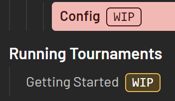

import WorkInProgress from '../../../../../../components/WorkInProgress.astro';

由于我们仅仅接受从仓库分支 (Folk) 提交来的拉取请求 (PR)，请确保先创建一个分支。

## 推荐先阅读

* [开发/导引/文档 - 运行环境](../docs-running-environment)
* [Starlight/编写 Markdown 内容](https://starlight.astro.build/guides/authoring-content/)
* [GitHub/从分支 (Fork) 创建拉取请求 (PR)](https://docs.github.com/en/pull-requests/collaborating-with-pull-requests/proposing-changes-to-your-work-with-pull-requests/creating-a-pull-request-from-a-fork)

## 目录结构

在仓库中，所有文档均生成并存放在 `Docs/src/content/docs/en`。\
其他以 `en` 文件夹内的文档作为原文的翻译文档也存放在这里。\
如果你想要贡献翻译，请申请 https://translate.corsace.io 的访问权限，并加入 [Corsace Discord 服务器](https://discord.gg/Z6vEMsr)。

如果你想创建任意文件，请确保它存放在 `Docs/src/content/docs/en` 或其下的子文件夹。\
其中的文件夹结构类似于网站上侧边栏的层次结构。\
总的来看，有三个主要部分：

* [设计文档](design)
* [开发文档](development)
* [如何在 Corsace 运行比赛的文档](tournaments)

在此之中，我们主要使用 [Diátaxis 框架](https://diataxis.fr/)作为文档编写的[结构指南](https://diataxis.fr/how-to-guides/)，并主要关注编写指南和[参考](https://diataxis.fr/reference/)。

## 文档解析

It will be assumed that you understand the markdown format and extra features Starlight provides for writing it based on the [Pre-requisite Reading](#pre-requisite-reading) section.

It's recommended to use a .mdx file for documentation in order to provide extra functionality via Javascript/JSX.

For any document that is expected to not be fully written/linked to other documents to, make sure to read the [Work In Progress Documents](#work-in-progress-documents) section.

### File name

Simply create a document with the title of the file as lowercased and with words separated by hypens `-`.
For example, since the title of this document is `Docs - Write/Edit Documents`, the file name is `docs-write-edit-documents.mdx`.

### Frontmatter

Almost every document should have the following in its frontmatter:

* `title` - The title of the document
* `description` - A short description for the document's use case
* `lastUpdated` - The date you are creating/editing the document in `YYYY-MM-DD` format
* `sidebar`
  * `order` - The order of the document, the lower the number, the higher it will appear on the left sidebar.
  * Note: The ordering for sub-documents is created using a 4 digit number. This is used similarly to an ID system for the documents.

Here is this file's frontmatter as an example:

```yml
---
title: Docs - Write/Edit Documents
description: Writing/Editing documentation for Corsace
lastUpdated: 2023-09-17
sidebar:
    order: 1110
---
```

### Main Body

All headers shuold use at least 2 hashtags `##` in order to properly appear.\
Astro Starlight automtically creates an `## Overview` internally, so for any introductory text, you do not need to add an extra header.

If your documentation is dependant on any other documents within this repository, or from Astro Starlight, then make sure to add a `## Pre-requisite Reading` section after your introductory text, but BEFORE any other section you create.

### Images

Images should be put in the `Assets/img/docs` directory. When you want to input an image into your document you can do so with a relative link.
To access an image in `Assets/img/docs` from this file (which is at `Docs/src/content/docs/en/development/Client/Guide/docs-write-edit-documents.mdx`), you require the following relative direction:

```mdx

```

每个 `../` 表示路径往外移动一个文件夹。

### 变量

如果您需要添加应该表示为变量的内容，请使用 `[VARIABLE]`。

比如，`config.[SITE].host` 中，`SITE` 是变量，并可以根据`主机`设定的域名自动切换。

## 正在编写中 (WIP) 的文档

As Corsace is an ever-growing repository with many moving parts that are still being built on, there will be a lot of documentation that can't be fully finished.

When this is the case, the following features should be added into your document:

### WIP 前言

在文章的前文中，这个标签必须添加到 `sidebar` 中：

```yml
  badge:
    text: WIP
    variant: caution
```

比如这个文档：

```yml
---
title: Docs - Write/Edit Documents
description: Writing/Editing documentation for Corsace
lastUpdated: 2023-09-17
sidebar:
    badge:
        text: WIP
        variant: caution
    order: 1110
---
```

这会在文档的左侧边栏添加一个这样子的 WIP 图标：\


### WIP 章节

If there's a specific section that is a work in progress, a component has been created called `WorkInProgress` within the `Docs/src/components` folder to label them as such.\
You should import it AFTER your frontmatter, but BEFORE any text is added, and use a similar method of relative directory writing for importing images.\
For this document as an example:

```mdx
---
title: Docs - Write/Edit Documents
description: Writing/Editing documentation for Corsace
lastUpdated: 2023-09-17
sidebar:
    badge:
        text: WIP
        variant: caution
    order: 1110
---
import WorkInProgress from '../../../../../../components/WorkInProgress.astro';

## Pre-requisite Reading
```

Afterwards, you can place it into whichever section like so:

```mdx
<WorkInProgress section="section/name" />
```

Which will look like:

<WorkInProgress section="section/name" />
