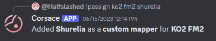
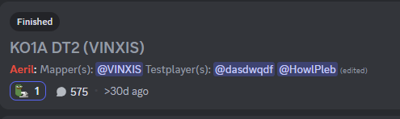
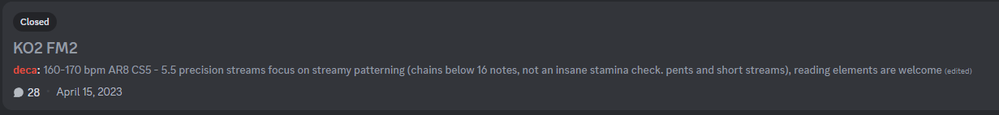
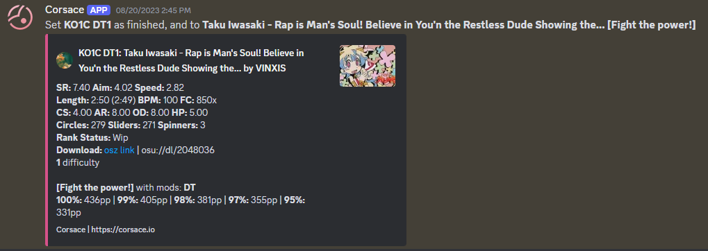

## Prerequisite Reading

* [Running Tournaments/Getting Started](../)
* [Running Tournaments/Stage/Round Creation](../stage-round-creation)
* [Running Tournaments/Mappool Creation](../mappool-creation)

## Custom Mappooling
Custom mappooling is the process of creating custom beatmaps for a tournament's mappool instead of using existing beatmaps. This process is more complex than using existing beatmaps, as it requires the creation of new beatmaps by custom mappers you have added to your staff. The Corsace Discord bot provides features to help manage this process.

### Assigning Custom Mappers and Testplayers
To start custom mappooling, you will need to assign custom mappers to the tournament. This can be done via the `/mappool_assign custom` command in a `mappool` or `admin` channel you had designated during the [tournament creation](../#tournament-creation) section. An example of a successfully assigned custom mapper is shown below:

You can also run the command again to assign multiple custom mappers to the same slot. This is useful for collab beatmaps where you have multiple mappers working on the same map.

## Special Features for Custom Mappooling
During tournament channel designation in the [tournament creation](../#tournament-creation) section, you may have noticed certain features specifically for custom mappooling: `Mappool QA` abd `Job Board`. These channels are highly recommended to have for custom mappooling. Both of these utilize forum channels provided by Discord. Their function is described below.

### Mappool QA
Mappool QA is a forum channel that will create a thread channel within it any time a map slot is assigned to a user via `/mappool_assign custom`. This allows for ease of discussion regarding the map away from other channels. An example thread channel can be seen in the image below:

This forum channel will also autogenerate the following tags:
- **WIP** - Automatically applied to the thread when a custom mapper first submits their map.
- **Finished** - A tag you can manually apply when the custom mapper has finished their map.
- **Late** - A tag that gets automatically applied if the deadline created from `/mappool_deadline` has passed. If you had created a `mappoolLog` channel as well, it will post a message there when the deadline passes too.
- **Needs HS** - A tag that you can manually apply if the map has not been hitsounded.

### Job Board
Job Board is also a forum channel. This channel allows mappoolers to post requests for your custom mappers to create maps for given slots. This is useful for when you need a map for a specific slot, but don't exactly have a mapper to create it. An example of a Job Board post can be seen in the image below:

Job boards can be created via the `/job` command, allowing you to write a description for a given map slot that is currently empty.

Once you have created all the jobs you wish to create, you can run `/job_publish` command to create a thread in the Job Board forum channel for each job you have created. All jobs will automatically close with the given `end_time` parameter you provide to the `/job_publish` command.

When you have found a suitable custom mapper for the job, you can assign via `/mappool_assign custom` to the user. This will create a thread in the Mappool QA forum channel for the map slot, and automatically close the Job Board thread channel.

This forum channel will also autogenerate the following tags:
- **Open** - Automatically applied to the thread when a job is first created.
- **Closed** - Automatically applied when the job is closed either by the pooler(s) or by the deadline.
- **To Assign** - Automatically applied when a job is closed by the deadline.

## Finalizing Custom Map

Before you [publish your mappool](../mappool-creation#publishing-mappool) to the public, you will need to finalize the custom map(s). This means that the custom mapper(s) must have uploaded the beatmap to the osu! website. Once this is done, you can use the `/mappool_finish` command in a `mappool` or `admin` channel you had designated during the [tournament creation](../#tournament-creation) section. An example of a successfully finalized custom map is shown below:
