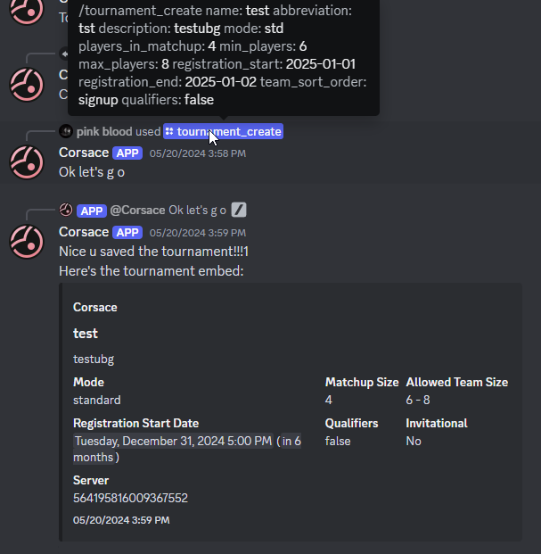

import tournament_create_success from "../../../../images/tournament_org/tournament_create_success.png";

:::note
    Corsace tournament management/organization is in an unstable phase. This documentation is pertaining to the current state of the system and may be subject to change.
    
    The discord bot required to manage tournaments is also not available to the public at this time. You may request access to the bot in the Corsace Discord server from ThePooN.
:::

This documentation provides information on how to create, run, and manage a tournament using Corsace services.

## Prerequisites
- Ensure you have logged in to the [Corsace website](https://corsace.io) at least once via osu! and discord before continuing.
- If you currently have a discord server for the tournament, ensure you are not (near) the 250 role limit.
- Ensure you have a role with `Administrator` permissions to create a tournament on the Corsace website.

You **DO NOT** need to be the organizer of the tournament to set up the initial tournament.

## Creating a baseline tournament
To get started, you will need to create a tournament via the Corsace Discord bot. This will allow you to manage the tournament, create matches, and more.

:::caution[Warning on slash vs message commands]
    The Corsace Discord bot supports both slash commands and message commands. This documentation will use slash commands for simplicity.

    It is also **highly recommended** to use slash commands when running `create` or `edit` discord commands with the Corsace Discord bot.
:::

### Tournament creation
The initial step is to create a tournament. Use the `/tournament_create` command in any channel in the server where you want the tournament to be created. Ensure you fill in all the required parameters.

If you are not the organizer of the tournament, there is an optional parameter to select who the true organizer is.

There are auto-checks for various cases that may be invalid, such as minTeamSize > maxTeamSize, or the tournament name being too long.

A successful creation will return an embed of the tournament details. An example of a successfully created tournament is shown below:

### Tournament editing
If you need to edit the tournament details, you can use the `/tournament_edit` command in an `admin` channel that you have designated in the [previous step](#tournament-creation). 

This command will go step by step through the tournament creation process, allowing you to edit any of the parameters you set in the initial creation.

### Tournament key
To access data that is otherwise not public, such as qualifier scores before they are released, or private mappools, and such, you will need the tournament key. You can get the tournament key by using the `/tournament_key` command in the tournament's discord server. This is primarily used for instances such as for streaming scenes, or API data. Accessing private information via the discord bot, and on the site itself do not require the tournament key.

## Tournament Screening
When registrations are done, and you are seeking for [Official Tournament Support](https://osu.ppy.sh/wiki/en/Tournaments/Official_support), then you will need to send a list of all the players that are in your tournament. You can send a .csv file containing the list in the format they desire using the discord command `/tournament_screening`.

In the case where the tournament is a solo player tournament that does not officially require "teams", you may remove the second column by importing the .csv file into Excel or Google Sheets, and re-export it.

## Next Steps
Once you have created a tournament, you can proceed to [creating stages and rounds](./stage-round-creation) for the tournament itself, followed by [creating mappools](./mappool-creation) for the stages and rounds.