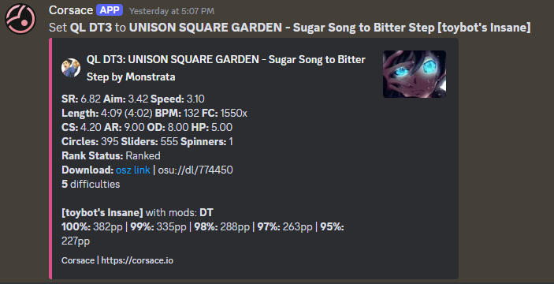
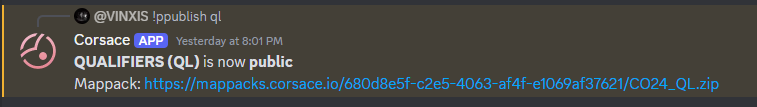

## Prerequisite Reading

* [Running Tournaments/Getting Started](../)
* [Running Tournaments/Stage/Round Creation](../stage-round-creation)

## Mappool Creation
Mappools can be designated to either stages or rounds. If you are running a typical tournament with a qualifiers and double elimination bracket, you will likely create a mappool for the qualifiers stage, and then a mappool for each round in the double elimination bracket.

To create a mappool, use the `/mappool_create` command in an `admin` or `mappool` channel that you had designated during the [tournament creation](#tournament-creation) section. The only parameter is the target_sr, as the command will guide you through each part of the mappool creation process.

:::caution
    Please ensure the mappool is being made for the right stage/round. It can easily occur where you create a mappool for the entire bracket, when in fact you wanted to create a mappool only for Round of 16 for example.
:::

### Mappool Slot creation
During the process in creating a mappool, you will be asked to create mappool slots/categories. This deserves its own section due to the complexity of slot creation.

A mappool slot is a category of maps that you will be adding maps to. For example, you may have a `FreeMod` slot, a `Hidden` slot, and a `NoMod` slot. Each slot can have multiple maps, and can have a unique set of rules to them. The unique set of rules is where the complexity comes from.

When the bot asks you to create mappool slots, each message you send will correspond to each mappool slot created. The format of each message would be as follows:
```md
(Slot Acronym) (Slot Name) (# of Maps) [Mods Required] [# of users that require mods] [# of unique mods required]

(Round brackets are required)
[Square brackets are optional]
```

In case you may ever need to add maps or slots, you can use `/mappool_add`.

#### Examples:

**NM Nomod 6 NM** - Creates a mappool slot called Nomod with 6 maps. It is enforced that no mods are allowed for anyone.

**NM Nomod 6** - Creates a mappool slot called Nomod with 6 maps. No mod requirements are enforced, which means any mod can be used by any player.

**FM Freemod 3 HDHRFL 2 2** - Creates a mappool slot called Freemod with 3 maps. It is enforced that 2 players must use one of the mods HD, HR, or FL by each team, and 2 of the mods HD, HR, FL must be used by each team.

**FM Freemod 3 2 2** - Creates a mappool slot called Freemod with 3 maps. It is enforced that 2 players must use any mod by each team, and 2 mods must be used by each team. The mod choice is not restricted.

## Adding Beatmaps to Mappool

Once you have created the mappool, you can add beatmaps to the mappool.

Use the `/mappool_assign beatmap` command in a `mappool` or `admin` channel you had designated during the [tournament creation](../#tournament-creation) section, filling out all parameters.

A successful run of the command will return an embed of the beatmap's details. An example of a successfully added beatmap to the slot `DT3` in the pool `QL` is shown below:


If your tournament is creating custom beatmaps for the mappool instead of using existing beatmaps, go to the [Custom Mappooling](../custom-mappooling) page.

## Publishing Mappool

Once your mappool is all ready with all the map slots filled, and it is the proper time to release the mappool to the public, you can simply use the `/mappool_publish` command in a `mappool` or `admin` channel you had designated during the [tournament creation](../#tournament-creation) section. You may attach a zip file of the mappack yourself, or let the Corsace Discord bot automatically generate one [using an osu! beatmap mirror](https://osu.direct/).

A successful run of the command will return a message with a permanent link to the mappool's mappack. An example of a successfully published mappool is shown below:
