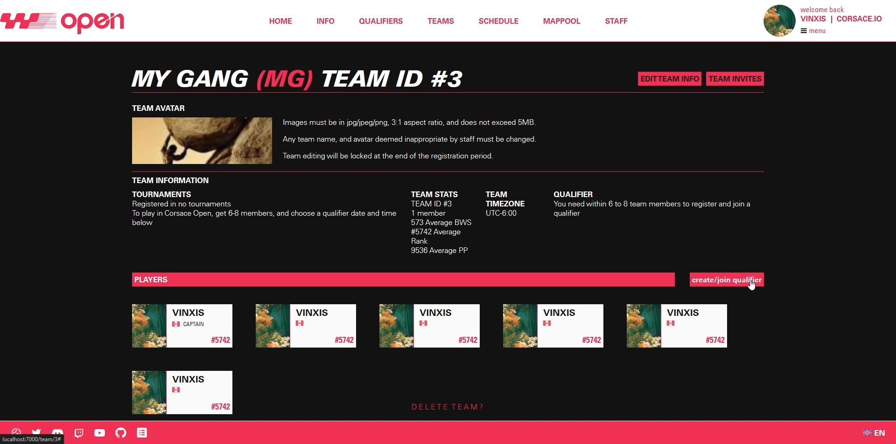

import CorsaceOnly from '../../../../components/CorsaceOnly.astro';

## Prerequisite Reading

* [Playing Tournaments/Getting Started](../)

## Joining a tournament
:::danger
Implementation is in a very primitive stage. This will currently only work for tournaments with a qualifier stage that also allows users to schedule them to whenever they want.

Registration into a tournament currently implies that the user/team is scheduling for a qualifier as well. 
:::

For any non-Corsace Open tournament, you will need to join the tournament via the Corsace Discord bot. This will imply that you are also registering for a time for a qualifier.

To join a tournament, use the `qualifier_team` command in a channel with the date and time you wish to play the qualifier.

If the tournament is a team tournament, then it will ask which team that you are captain for you wish to register. 

If the tournament is a solo tournament, then it will create a solo team for you automatically if one doesn't currently exist for you, and register + schedule you for the qualifier.

### Joining a Corsace Open tournament
For Corsace Open tournaments, you will need to join the tournament via the Corsace Open website. This will imply that you are also registering for a time for a qualifier. The `JOIN QUALIFIERS` button should not be disabled and red if you have a suitable number of players in your team.

After clicking the `JOIN QUALIFIERS` button and confirming the time, you will be registered for the qualifier. You can also see the time you have registered for in the `QUALIFIERS` section of the tournament page.

## Next Steps
As registering for a tournament entails scheduling for a qualifier, you can proceed to [playing matches](./playing-matches) which also includes information about playing qualifiers, especially if they are autoreffed.