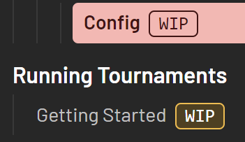

import WorkInProgress from '../../../../../../components/WorkInProgress.astro';

Pastikan bahwa kamu telah membuat fork, karena kami hanya menerima kontribusi melalui pull request dari fork repositori.

## Bacaan Prasyarat

*   [Development/Guide/Docs - Running Environment](../docs-running-environment)
*   [Starlight/Authoring Content in Markdown](https://starlight.astro.build/guides/authoring-content/)
*   [GitHub/Creating a pull request from a fork](https://docs.github.com/en/pull-requests/collaborating-with-pull-requests/proposing-changes-to-your-work-with-pull-requests/creating-a-pull-request-from-a-fork)

## Directory Structure

In the repository, all documentation that is generated is located at `Docs/src/content/docs/en`.\
Other languages are also there, but are typically translated from the `en` folder.\
If you wish to translate instead, request access at https://translate.corsace.io, and join the [Corsace discord server](https://discord.gg/Z6vEMsr)

For any document you wish to create, it must reside somewhere within `Docs/src/content/docs/en` or its sub-folders.\
The folder structure within this is similar to the sidebar's hierarchy on the website.\
Primarily, there are 3 main sections:

*   [Design Documentation](design)
*   [Development Documentation](development)
*   [Documentation on how to run tournaments via Corsace](tournaments)

Within these, the [Diátaxis framework](https://diataxis.fr/) is used as the structural guide for writing documentation; however, the main focus is on writing [Guides](https://diataxis.fr/how-to-guides/) and [References](https://diataxis.fr/reference/).

## Document Anatomy

It will be assumed that you understand the markdown format and extra features Starlight provides for writing it based on the [Pre-requisite Reading](#pre-requisite-reading) section.

It's recommended to use a .mdx file for documentation in order to provide extra functionality via Javascript/JSX.

For any document that is expected to not be fully written/linked to other documents to, make sure to read the [Work In Progress Documents](#work-in-progress-documents) section.

### File name

Simply create a document with the title of the file as lowercased and with words separated by hypens `-`.
For example, since the title of this document is `Docs - Write/Edit Documents`, the file name is `docs-write-edit-documents.mdx`.

### Frontmatter

Almost every document should have the following in its frontmatter:

*   `title` - The title of the document
*   `description` - A short description for the document's use case
*   `lastUpdated` - The date you are creating/editing the document in `YYYY-MM-DD` format
*   `sidebar`
    *   `order` - The order of the document, the lower the number, the higher it will appear on the left sidebar.
    *   Note: The ordering for sub-documents is created using a 4 digit number. This is used similarly to an ID system for the documents.

Here is this file's frontmatter as an example:

```yml
---
title: Docs - Write/Edit Documents
description: Writing/Editing documentation for Corsace
lastUpdated: 2023-09-17
sidebar:
    order: 1110
---
```

### Main Body

All headers shuold use at least 2 hashtags `##` in order to properly appear.\
Astro Starlight automtically creates an `## Overview` internally, so for any introductory text, you do not need to add an extra header.

If your documentation is dependant on any other documents within this repository, or from Astro Starlight, then make sure to add a `## Pre-requisite Reading` section after your introductory text, but BEFORE any other section you create.

### Images

Images should be put in the `Assets/img/docs` directory. When you want to input an image into your document you can do so with a relative link.
To access an image in `Assets/img/docs` from this file (which is at `Docs/src/content/docs/en/development/Client/Guide/docs-write-edit-documents.mdx`), you require the following relative direction:

```mdx

```

Each `../` moves up one folder in the directory.

### Variables

If you ever need to add something that should be denoted as a variable, do so by writing it as `[VARIABLE]`.

For example, `config.[SITE].host` means that `SITE` is a variable, and this is referring to the `host` option for a given site.

## Work In Progress Documents

As Corsace is an ever-growing repository with many moving parts that are still being built on, there will be a lot of documentation that can't be fully finished.

When this is the case, the following features should be added into your document:

### WIP Frontmatter

In your frontmatter, the following should be added into `sidebar`:

```yml
  badge:
    text: WIP
    variant: caution
```

For example with this document:

```yml
---
title: Docs - Write/Edit Documents
description: Writing/Editing documentation for Corsace
lastUpdated: 2023-09-17
sidebar:
    badge:
        text: WIP
        variant: caution
    order: 1110
---
```

This will provide a WIP icon to the document on the left sidebar like so:\


### WIP section

If there's a specific section that is a work in progress, a component has been created called `WorkInProgress` within the `Docs/src/components` folder to label them as such.\
You should import it AFTER your frontmatter, but BEFORE any text is added, and use a similar method of relative directory writing for importing images.\
For this document as an example:

```mdx
---
title: Docs - Write/Edit Documents
description: Writing/Editing documentation for Corsace
lastUpdated: 2023-09-17
sidebar:
    badge:
        text: WIP
        variant: caution
    order: 1110
---
import WorkInProgress from '../../../../../../components/WorkInProgress.astro';

## Pre-requisite Reading
```

Afterwards, you can place it into whichever section like so:

```mdx
<WorkInProgress section="section/name" />
```

Which will look like:

<WorkInProgress section="section/name" />
