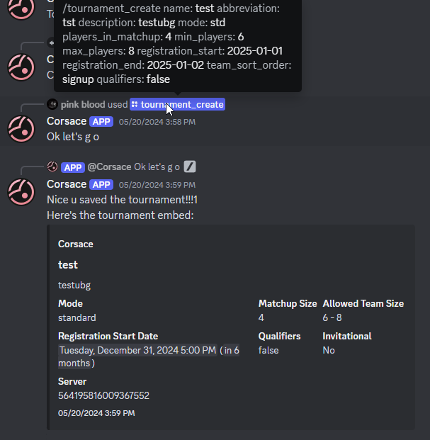

import tournament_create_success from "../../../../images/tournament_org/tournament_create_success.png";

:::note
    Corsace tournament management/organization is in an unstable phase. This documentation is pertaining to the current state of the system and may be subject to change.

```
Bot Discord yang dibutuhkan untuk mengelola turnamen saat ini tidak tersedia secara publik. Kamu dapat meminta akses ke bot ini kepada ThePooN pada server Discord Corsace.
```

:::

Dokumentasi ini menyediakan informasi seputar cara membuat, menjalankan, dan mengelola turnamen melalui layanan Corsace.

## Persyaratan

- Pastikan kamu sebelumnya sudah terhubung masuk ke [situs web Corsace](https://corsace.io) melalui osu! dan Discord setidaknya sekali sebelum melanjutkan.
- Apabila kamu memiliki server Discord untuk turnamenmu, pastikan kamu tidak sedang berada pada (atau mendekati) batas 250 role.
- Pastikan kamu memiliki role dengan perizinan `Administrator` untuk membuat turnamen pada situs web Corsace.

Kamu **TIDAK PERLU** untuk menjadi pengelola turnamen untuk membuat pengaturan awal turnamen.

## Membuat turnamen dasar

Untuk memulai, kamu perlu untuk membuat turnamen melalui bot Discord Corsace. Hal ini akan memungkinkan kamu untuk mengelola turnamen, membuat pertandingan, dan masih banyak lagi.

:::caution[Warning on slash vs message commands]

```
Kamu **sangat disarankan** untuk menggunakan perintah slash pada saat menjalankan perintah `create` atau `edit` dengan bot Discord Corsace.
```

:::

### Pembuatan turnamen

Langkah pertama adalah untuk membuat turnamen. Gunakan perintah `/tournament_create` pada channel mana pun di server tempat kamu ingin membuat turnamen. Pastikan kamu mengisi seluruh parameter yang dibutuhkan.

If you are not the organizer of the tournament, there is an optional parameter to select who the true organizer is.

There are auto-checks for various cases that may be invalid, such as minTeamSize > maxTeamSize, or the tournament name being too long.

A successful creation will return an embed of the tournament details. An example of a successfully created tournament is shown below:


### Tournament editing

If you need to edit the tournament details, you can use the `/tournament_edit` command in an `admin` channel that you have designated in the [previous step](#tournament-creation). 

This command will go step by step through the tournament creation process, allowing you to edit any of the parameters you set in the initial creation.

### Tournament key

To access data that is otherwise not public, such as qualifier scores before they are released, or private mappools, and such, you will need the tournament key. You can get the tournament key by using the `/tournament_key` command in the tournament's discord server. This is primarily used for instances such as for streaming scenes, or API data. Accessing private information via the discord bot, and on the site itself do not require the tournament key.

## Tournament Screening

When registrations are done, and you are seeking for [Official Tournament Support](https://osu.ppy.sh/wiki/en/Tournaments/Official_support), then you will need to send a list of all the players that are in your tournament. You can send a .csv file containing the list in the format they desire using the discord command `/tournament_screening`.

In the case where the tournament is a solo player tournament that does not officially require "teams", you may remove the second column by importing the .csv file into Excel or Google Sheets, and re-export it.

## Langkah Selanjutnya

Once you have created a tournament, you can proceed to [creating stages and rounds](./stage-round-creation) for the tournament itself, followed by [creating mappools](./mappool-creation) for the stages and rounds.
