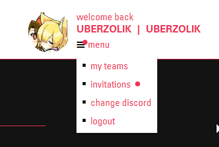
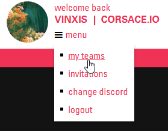
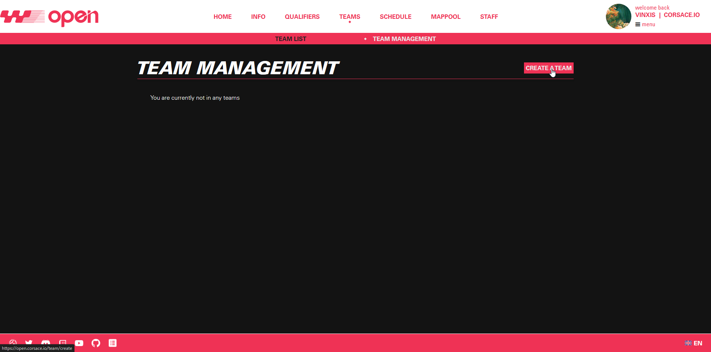
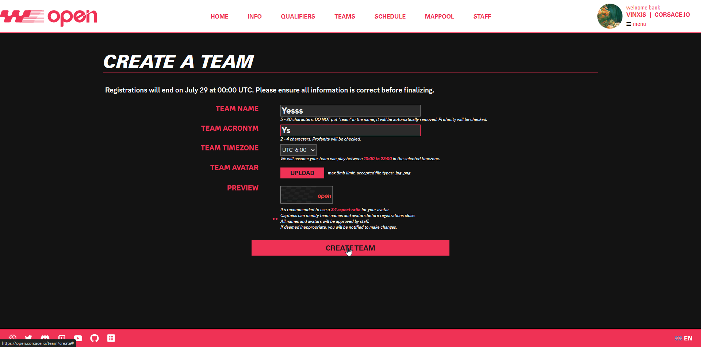
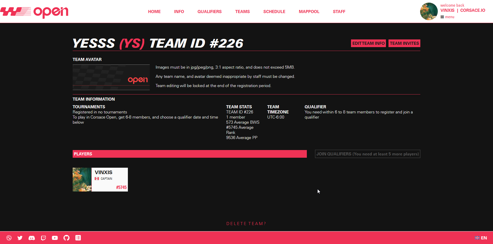

Niniejsza dokumentacja zawiera informacje na temat dodatkowych funkcji dostępnych dla graczy, a także wszelkie niezbędne informacje, które mogą być potrzebne podczas uczestnictwa w turnieju zorganizowanym przez Corsace.

## Warunki wstępne

* Zapewnij się, że zalogowałeś się na stronę internetową [Corsace](https://corsace.io) chociaż raz poprzez osu! i Discorda przed kontynuowaniem.
* Upewnij się, że dołączyłeś do serwera Discord turnieju, w którym bierzesz udział.

## Dołączanie drużyny

:::note
Aby dołączyć do dowolnego turnieju, który nie jest turniejem solo lub 1 na 1, wymagana jest drużyna. Jeśli chcesz wziąć udział w turnieju solo 1 na 1, możesz pominąć tę sekcję.
:::

Obecnie możesz dołączyć do drużyny albo przez stronę internetową, albo za pomocą bota Corsace na Discordzie. Kapitan drużyny musi cię najpierw zaprosić do drużyny, zanim będziesz mógł dołączyć.

### From the web

To join a team from the web, go to and log in to the [Corsace Open website](https://open.corsace.io). Once logged in, the menu's 3 lines should have a red dot if the captain had already invited you. Click menu -> invitations to be transferred to the team invites page. The invitations option should also have a red dot if you have any pending invites.

From here, you can click the `ACCEPT` button to join the team. You may also press `DECLINE` for any invites you do not wish to accept to clear them from your list.

### From the Corsace Discord bot

You can also join a team via the Corsace Discord bot. To do this, use the `/invite_accept` command in a channel where the Corsace Discord bot is present. Fill in the necessary parameters and the bot will send a request to the team captain to join the team.

You may also see a list of invites you have received by using the `/list_invites` command in a channel where the Corsace Discord bot is present.

## Creating a team

:::note
Teams are necessary for joining any non-solo non-1v1 tournament. If you are looking to participate in a solo 1v1 tournament, you can skip this section.
:::

To create a team, go to and log in to the [Corsace Open website](https://open.corsace.io). Once logged in, click menu -> my teams to be transferred to the team listing page of all the teams you are currently in.

From here, you should be in the `TEAM MANAGEMENT` section. In this page, you can click the `CREATE A TEAM` button to create a new team. Fill in the necessary information and click `CREATE TEAM` to finish the process.

### Inviting players to your team

You can currently invite players either from the web, or from the Corsace Discord bot.

#### From the web

Once you have created a team, you can invite players to join your team. To do this, go to the team page of the team you created. You can find this by clicking the team name in the team management page.

From the team page, you can click the `TEAM INVITES` button to be transferred to the team invites page. Here, you can invite players to your team by entering their osu! username and clicking `INVITE PLAYER`.

#### From the Corsace Discord bot

You can also invite players to your team via the Corsace Discord bot. To do this, use the `/team_invite` command in a channel where the Corsace Discord bot is present. Fill in the necessary parameters and the bot will send an invite to the player.

## Next Steps

Once you have joined or created a team, you can proceed to [joining a tournament](./joining-tournament) to participate in the tournament itself.
